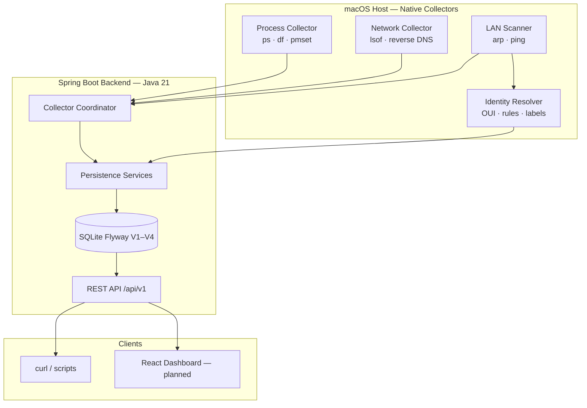

# JTracer Observability Engine

**Cross-layer endpoint observability for laptops and local networks — process, network, and LAN intelligence in one local-first platform.**

[](https://openjdk.org/)
[](https://spring.io/projects/spring-boot)
[-lightgrey)](docs/DEVELOPMENT_PHASES.md)
[](LICENSE)

---

## Overview

JTracer correlates **system performance**, **outbound network connections**, and **LAN device presence** into a single investigation workflow. It answers questions that normally require Activity Monitor, browser DevTools, and router admin panels — without cloud accounts, telemetry, or packet capture.

| Layer | Capability | Status |
|-------|------------|--------|
| **Process** | CPU, memory, RSS, disk, battery via host collectors | Phase 2 ✅ |
| **Network** | TCP/UDP connections, reverse DNS, process correlation | Phase 3 ✅ |
| **LAN** | ARP-based device discovery, online/offline tracking | Phase 4 ✅ |
| **Device identity** | OUI lookup, rule engine, user labels | Phase 5 ✅ |
| **API** | REST `/api/v1/*` (health live; more endpoints in progress) | Phase 6 🚧 |
| **UI** | React dashboard | Phase 8 (planned) |

**Design principles:** local-first · metadata-only · adapter-based cross-platform · evidence-backed insights

> **Your data:** In `LIVE` capture mode, API responses reflect **real data from your Mac** — processes, connections, and LAN devices observed by host-native collectors and stored in local SQLite. No cloud sync, no synthetic fallback.

---

## Architecture

Host-native collectors observe the real operating system. A Spring Boot backend normalizes snapshots into SQLite and exposes a REST API; a React dashboard (planned) will consume that API.



Full design narrative: [docs/SYSTEM_DESIGN.md](docs/SYSTEM_DESIGN.md) · Mermaid source: [docs/diagrams/system-design.mmd](docs/diagrams/system-design.mmd)

### Data correlation model

```text
ObservedProcess  →  NetworkConnection  →  RemoteEndpoint / DomainIdentity
                                              ↓ (IP match)
                                         LanDevice  →  DeviceIdentity
```

### Persistence abstraction (future)

```text
PersistenceProvider
├── LocalSQLitePersistenceProvider   # MVP / default (active)
├── TursoPersistenceProvider         # future cloud/sync
└── PostgresPersistenceProvider      # future team/server mode
```

---

## Capabilities

### Process monitoring (Phase 2 ✅)
- Running process inventory with PID, command line, executable path
- CPU %, memory %, RSS samples on configurable poll interval (default 5s)
- System health snapshots: disk usage, memory, battery

### Network tracking (Phase 3 ✅)
- TCP/UDP connection metadata via `lsof` (no payloads, no HTTPS MITM)
- Remote IP, port, protocol, connection state, direction
- Reverse DNS with timeout and confidence scoring
- Process-to-connection correlation by session + PID

### LAN discovery (Phase 4 ✅)
- Subnet discovery via `ifconfig` / route table
- Device inventory via `arp -a` (60s poll)
- Optional bounded ping to seed ARP for silent hosts
- Online / offline / new device status tracking

### Device identity (Phase 5 ✅)
- Local OUI vendor lookup (`knowledge-base/oui-vendors.json`)
- Rule-based classification (`device-rules.json`, `mdns-services.json`)
- User label override with `CONFIRMED` confidence
- Evidence-backed display names (e.g. Amazon Echo, Apple iPhone)

### REST API (Phase 6 🚧)
- `GET /api/v1/system/health` — latest machine health snapshot ✅
- `GET /api/v1/processes` — running processes with CPU/memory/connection counts ✅
- `GET /api/v1/processes/{id}` — process detail ✅
- `GET /api/v1/processes/{id}/metrics` — metric history ✅
- `GET /api/v1/processes/{id}/connections` — active connections for process ✅
- `GET /api/v1/connections` — active connections ✅
- `GET /api/v1/domains` — domain frequency summary ✅
- `GET /api/v1/devices` — LAN devices with identity ✅
- `GET /api/v1/devices/{id}` — device detail ✅
- `POST /api/v1/devices/{id}/label` — user label override ✅
- Standard JSON envelope: `{ success, timestamp, data }`
- CORS configured for Vite dev server (`localhost:5173`)

---

## Tech stack

| Layer | Technology |
|-------|------------|
| Backend | Java 21, Spring Boot 3.4, Maven |
| Database | SQLite (MVP) via `LocalSQLitePersistenceProvider` |
| Migrations | Flyway (V1–V4) |
| Host collectors | Platform adapters (`ps`, `lsof`, `arp`, `ping`) |
| API | REST `/api/v1/*` (Phase 6); WebSocket `/ws/live` (planned) |
| Frontend | React, TypeScript, Vite (Phase 8) |
| Optional deploy | Docker Compose (API only; collectors stay on host) |

First platform: **macOS**. Windows/Linux via adapter interfaces without domain model changes.

---

## Repository structure

```text
jtracer/
├── backend/
│   ├── src/main/java/com/jtracer/
│   │   ├── domain/          # JPA entities and enums
│   │   ├── dto/             # Collector snapshot DTOs
│   │   ├── repository/      # Spring Data repositories
│   │   ├── service/         # Service interfaces
│   │   ├── collector/
│   │   │   ├── common/      # Identity resolver, OUI lookup
│   │   │   └── macos/parser/# OS output parsers (public)
│   │   ├── api/             # REST controllers (Phase 6)
│   │   ├── config/          # Spring configuration, CORS
│   │   └── persistence/     # PersistenceProvider abstraction
│   ├── src/main/resources/db/migration/  # Flyway V1–V4
│   └── Dockerfile
├── knowledge-base/          # OUI vendors, device rules, mDNS map
├── docs/                    # System design, phases, API contract
├── config/                  # application.yml.example
├── docker-compose.yml       # Optional API container
└── scripts/                 # Public release builder
```

---

## Development phases

| Phase | Focus | Status |
|-------|-------|--------|
| 0 | Documentation foundation | ✅ Complete |
| 1 | Domain entities + Flyway schema | ✅ Complete |
| 2 | macOS process collector | ✅ Complete |
| 3 | macOS network collector | ✅ Complete |
| 4 | LAN scanner (ARP, ping) | ✅ Complete |
| 5 | Device identity engine | ✅ Complete |
| 6 | REST APIs | 🚧 In progress |
| 7 | Manual validation | Planned |
| 8 | React dashboard | Planned |

Details: [docs/DEVELOPMENT_PHASES.md](docs/DEVELOPMENT_PHASES.md)

---

## Getting started

### Native development (recommended)

```bash
# 1. Configuration
cp config/application.yml.example backend/src/main/resources/application.yml
mkdir -p data

# 2. Run backend (collectors + API)
cd backend && mvn spring-boot:run

# 3. After ~10s (first health poll), query live data from YOUR Mac:
curl -s http://127.0.0.1:8080/api/v1/system/health | python3 -m json.tool
curl -s "http://127.0.0.1:8080/api/v1/processes?sort=cpu&limit=10" | python3 -m json.tool
curl -s http://127.0.0.1:8080/api/v1/connections | python3 -m json.tool
curl -s http://127.0.0.1:8080/api/v1/domains?sort=frequency | python3 -m json.tool
curl -s http://127.0.0.1:8080/api/v1/devices | python3 -m json.tool
```

Example response fields: `cpuPct`, `memoryPct`, `activeProcessCount`, `activeConnectionCount`, `onlineLanDeviceCount` — all sourced from host collectors writing to `./data/jtracer-live.db`.

### Tests

```bash
cd backend
mvn test                  # Unit tests (parsers, persistence, API)
mvn test -Plive-tests     # macOS live collector tests
```

### Optional Docker (API only)

Collectors must still run on the host. Docker shares `./data` with native collectors:

```bash
docker compose up --build backend
```

---

## Validation

| Check | Command / action |
|-------|------------------|
| System health API | `curl -s http://127.0.0.1:8080/api/v1/system/health` |
| Health history | `curl -s "http://127.0.0.1:8080/api/v1/system/snapshots?minutes=60"` |
| Top CPU processes | `curl -s "http://127.0.0.1:8080/api/v1/processes?sort=cpu&limit=10"` |
| Active connections | `curl -s http://127.0.0.1:8080/api/v1/connections` |
| Domain summary | `curl -s "http://127.0.0.1:8080/api/v1/domains?sort=frequency"` |
| LAN devices | `curl -s http://127.0.0.1:8080/api/v1/devices` |
| Insights | `curl -s http://127.0.0.1:8080/api/v1/insights` |
| Full test tracker | [docs/API_TESTING_CHECKLIST.md](docs/API_TESTING_CHECKLIST.md) |
| Process rows | `sqlite3 data/jtracer-live.db "SELECT COUNT(*) FROM observed_processes;"` |
| Network connections | `sqlite3 data/jtracer-live.db "SELECT remote_ip, remote_port, state FROM network_connections LIMIT 5;"` |
| LAN devices | `sqlite3 data/jtracer-live.db "SELECT ip_address, hostname, device_type FROM lan_devices;"` |

---

## Public vs private code

This repository publishes **architecture, domain model, parsers, API controllers, interfaces, knowledge base, and schema** — not the full host collector implementation.

| Public | Private (development workspace) |
|--------|--------------------------------|
| Entities, DTOs, enums, API controllers | `*ServiceImpl`, coordinator |
| Parser layer + identity resolver + tests | `MacPsCollector`, `MacLsofCollector` |
| Service interfaces | Live integration tests |
| Flyway migrations, `knowledge-base/` | Local SQLite databases (`data/`) |

Policy: [docs/PUBLIC_RELEASE.md](docs/PUBLIC_RELEASE.md) · Push workflow: `.cursor/skills/jtracer-public-release/`

---

## Roadmap

- [x] Phases 0–5: docs, domain, collectors, LAN, device identity
- [x] Phase 6: REST APIs, WebSocket `/ws/live`, snapshots, insights read API
- [ ] Phase 7: validation gate (see [docs/PHASE7_VALIDATION.md](docs/PHASE7_VALIDATION.md))
- [ ] Cross-platform adapters (Windows, Linux)
- [ ] Optional: Turso / Postgres persistence providers

---

## Documentation index

| Document | Description |
|----------|-------------|
| [SYSTEM_DESIGN.md](docs/SYSTEM_DESIGN.md) | Consolidated architecture |
| [DEVELOPMENT_PHASES.md](docs/DEVELOPMENT_PHASES.md) | Phase-wise build plan |
| [PHASE4_DESIGN.md](docs/PHASE4_DESIGN.md) | LAN discovery design |
| [DEVICE_IDENTITY_KNOWLEDGE_BASE.md](docs/DEVICE_IDENTITY_KNOWLEDGE_BASE.md) | Identity rules and signals |
| [ENTITY_DESIGN.md](docs/ENTITY_DESIGN.md) | Domain model |
| [API_CONTRACT.md](docs/API_CONTRACT.md) | REST/WebSocket spec |
| [API_TESTING_GUIDE.md](docs/API_TESTING_GUIDE.md) | curl + Postman testing walkthrough |
| [API_TESTING_CHECKLIST.md](docs/API_TESTING_CHECKLIST.md) | Step-by-step test tracker (work at your own pace) |
| [PHASE7_VALIDATION.md](docs/PHASE7_VALIDATION.md) | Pre-UI data correctness validation runbook |
| [PUBLIC_RELEASE.md](docs/PUBLIC_RELEASE.md) | Public code policy |

---

## Disclaimer

JTracer is a **personal observability platform** for systems you own or are authorized to monitor. It is not production security software or an antivirus replacement. Network visibility is **Level 1 metadata only** — no packet capture or HTTPS decryption in MVP.

---

## License

[MIT License](LICENSE)
