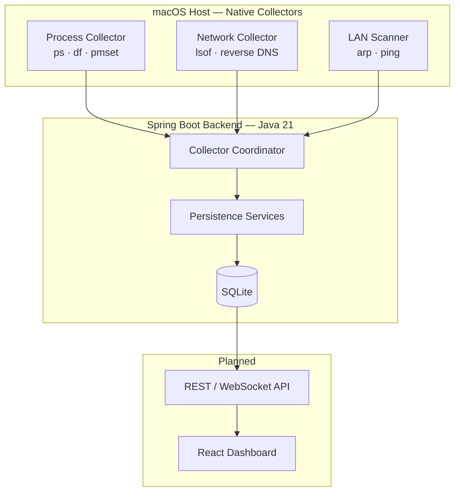

# JTracer Observability Engine

**Cross-layer endpoint observability for laptops and local networks — process, network, and LAN intelligence in one local-first platform.**

[](https://openjdk.org/)
[](https://spring.io/projects/spring-boot)
[-lightgrey)](docs/DEVELOPMENT_PHASES.md)
[](LICENSE)

---

## Overview

JTracer correlates **system performance**, **outbound network connections**, and **LAN device presence** into a single investigation workflow. It answers questions that normally require Activity Monitor, browser DevTools, and router admin panels — without cloud accounts, telemetry, or packet capture.

| Layer | Capability | Status |
|-------|------------|--------|
| **Process** | CPU, memory, RSS, disk, battery via host collectors | Phase 2 ✅ |
| **Network** | TCP/UDP connections, reverse DNS, process correlation | Phase 3 ✅ |
| **LAN** | ARP-based device discovery, online/offline tracking | Phase 4 🚧 |
| **API + UI** | REST/WebSocket, React dashboard | Phases 6–8 |

**Design principles:** local-first · metadata-only · adapter-based cross-platform · evidence-backed insights

---

## Architecture

Host-native collectors observe the real operating system. A Spring Boot backend normalizes snapshots into SQLite; a React dashboard (planned) exposes investigation views.



Full design narrative: [docs/SYSTEM_DESIGN.md](docs/SYSTEM_DESIGN.md) · Mermaid source: [docs/diagrams/system-design.mmd](docs/diagrams/system-design.mmd)

### Data correlation model

```text
ObservedProcess  →  NetworkConnection  →  RemoteEndpoint / DomainIdentity
                                              ↓ (IP match)
                                         LanDevice  →  DeviceIdentity
```

---

## Capabilities

### Process monitoring (Phase 2)
- Running process inventory with PID, command line, executable path
- CPU %, memory %, RSS samples on configurable poll interval (default 5s)
- System health snapshots: disk usage, memory, battery

### Network tracking (Phase 3)
- TCP/UDP connection metadata via `lsof` (no payloads, no HTTPS MITM)
- Remote IP, port, protocol, connection state, direction
- Reverse DNS with timeout and confidence scoring
- Process-to-connection correlation by session + PID

### LAN discovery (Phase 4 — designed)
- Subnet discovery via `ifconfig` / route table
- Device inventory via `arp -a` (60s poll — lightweight cache read)
- Optional bounded ping to seed ARP for silent hosts
- Correlation with network connections by IP (no schema merge)

See [docs/PHASE4_DESIGN.md](docs/PHASE4_DESIGN.md).

---

## Tech stack

| Layer | Technology |
|-------|------------|
| Backend | Java 21, Spring Boot 3.4, Maven |
| Database | SQLite (MVP) → PostgreSQL (future) |
| Migrations | Flyway |
| Host collectors | Platform adapters (`ps`, `lsof`, `arp`, `ping`) |
| Frontend | React, TypeScript, Vite (planned) |
| API | REST `/api/v1/*`, WebSocket `/ws/live` (planned) |

First platform: **macOS**. Windows/Linux via adapter interfaces without domain model changes.

---

## Repository structure

```text
jtracer-observability-engine/
├── backend/
│   ├── src/main/java/com/jtracer/
│   │   ├── domain/          # JPA entities and enums
│   │   ├── dto/             # Collector snapshot DTOs
│   │   ├── repository/      # Spring Data repositories
│   │   ├── service/         # Service interfaces
│   │   ├── collector/
│   │   │   ├── common/      # Provider interfaces
│   │   │   └── macos/parser/# OS output parsers (public)
│   │   ├── config/          # Spring configuration
│   │   └── api/             # REST layer (Phase 6)
│   └── src/main/resources/db/migration/
├── docs/                    # System design, phases, API contract
├── config/                  # application.yml.example
└── scripts/                 # Public release builder
```

---

## Development phases

| Phase | Focus | Status |
|-------|-------|--------|
| 0 | Documentation foundation | ✅ Complete |
| 1 | Domain entities + Flyway schema | ✅ Complete |
| 2 | macOS process collector | ✅ Complete |
| 3 | macOS network collector | ✅ Complete |
| 4 | LAN scanner (ARP, ping) | 🚧 Designed |
| 5 | Device identity engine | Planned |
| 6 | REST + WebSocket APIs | Planned |
| 7 | Manual validation | Planned |
| 8 | React dashboard | Planned |

Details: [docs/DEVELOPMENT_PHASES.md](docs/DEVELOPMENT_PHASES.md)

---

## Validation

### Automated tests (private workspace)

```bash
cd backend
mvn test                  # Unit tests (parsers, persistence)
mvn test -Plive-tests     # macOS live collector tests
```

### Manual validation checklist

| Check | Command / action |
|-------|------------------|
| Process rows persisted | `sqlite3 data/jtracer-live.db "SELECT COUNT(*) FROM observed_processes;"` |
| Network connections | `sqlite3 data/jtracer-live.db "SELECT remote_ip, remote_port, state FROM network_connections LIMIT 5;"` |
| Process correlation | Join `network_connections` → `observed_processes` on PID |
| Generate traffic | `curl -s https://example.com` then re-query connections |

### Screenshots

Add validation screenshots to [docs/assets/](docs/assets/) for portfolio presentation:

- Collector log output showing persisted snapshots
- SQLite query results for processes and connections
- Architecture diagram render

---

## Public vs private code

This repository publishes **architecture, domain model, parsers, interfaces, and schema** — not the full host collector implementation.

| Public | Private (development workspace) |
|--------|--------------------------------|
| Entities, DTOs, enums | `*ServiceImpl`, coordinator |
| Parser layer + tests | `MacPsCollector`, `MacLsofCollector` |
| Service interfaces | Live integration tests |
| Flyway migrations | Local SQLite databases |

Policy: [docs/PUBLIC_RELEASE.md](docs/PUBLIC_RELEASE.md)

---

## Getting started

```bash
# 1. Copy configuration template
cp config/application.yml.example backend/src/main/resources/application.yml

# 2. Create local data directory (gitignored)
mkdir -p data

# 3. Run tests (requires full private workspace for persistence tests)
cd backend && mvn test
```

> **Note:** A runnable collector stack requires the private implementation layer.
> The public repo demonstrates design and parser quality; see release policy above.

---

## Roadmap

- [x] Phases 0–3: docs, domain, process + network collectors
- [ ] Phase 4: LAN discovery engine
- [ ] Phase 5: Device identity (OUI, rules, user labels)
- [ ] Phase 6–8: APIs, validation, dashboard
- [ ] Cross-platform adapters (Windows, Linux)
- [ ] Optional: native agent extraction, Kubernetes control plane

---

## Documentation index

| Document | Description |
|----------|-------------|
| [SYSTEM_DESIGN.md](docs/SYSTEM_DESIGN.md) | Consolidated architecture |
| [DEVELOPMENT_PHASES.md](docs/DEVELOPMENT_PHASES.md) | Phase-wise build plan |
| [PHASE4_DESIGN.md](docs/PHASE4_DESIGN.md) | LAN discovery design |
| [ENTITY_DESIGN.md](docs/ENTITY_DESIGN.md) | Domain model |
| [API_CONTRACT.md](docs/API_CONTRACT.md) | REST/WebSocket spec |
| [DATA_SOURCES.md](docs/DATA_SOURCES.md) | Approved OS data sources |
| [PUBLIC_RELEASE.md](docs/PUBLIC_RELEASE.md) | Public code policy |

---

## Disclaimer

JTracer is a **personal observability platform** for systems you own or are authorized to monitor. It is not production security software or an antivirus replacement. Network visibility is **Level 1 metadata only** — no packet capture or HTTPS decryption in MVP.

---

## License

[MIT License](LICENSE)
